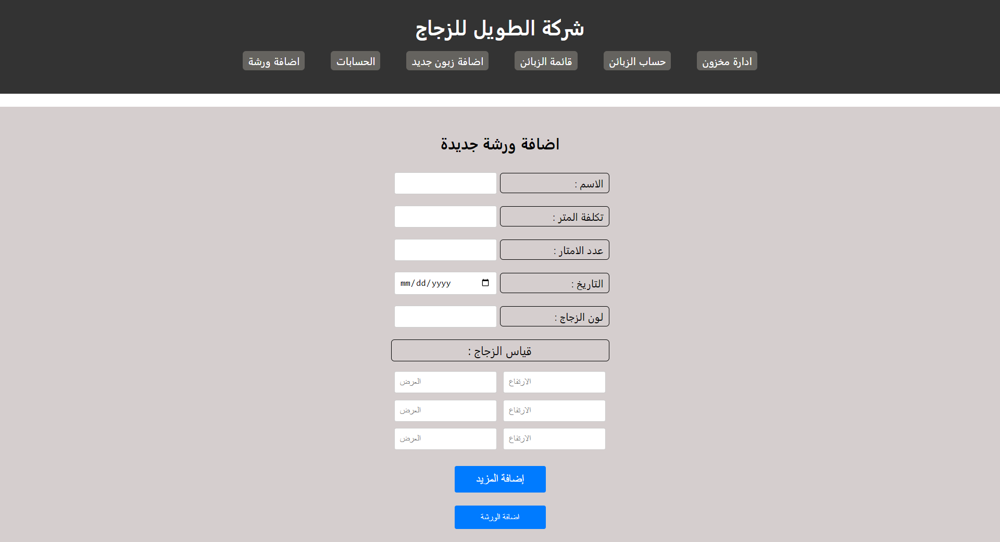
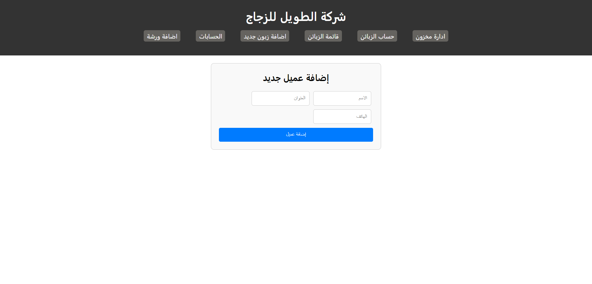
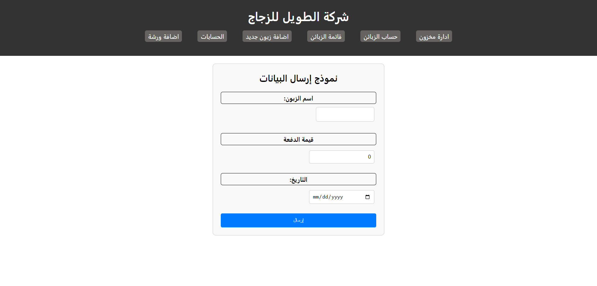
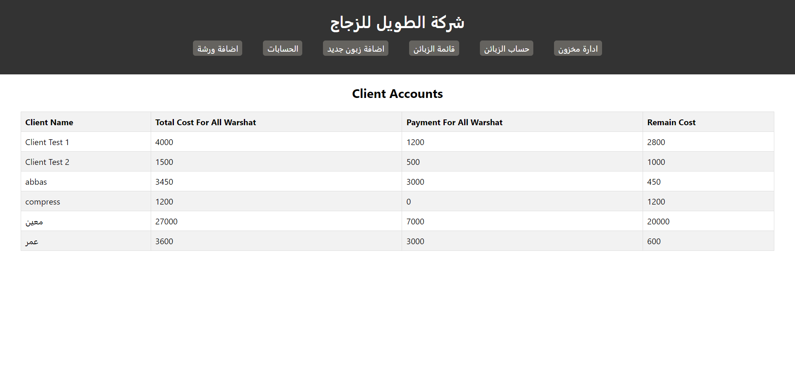

# Glass Shop Management Application 🛠️💼

Welcome to the Glass Shop Management Application! This project is designed to streamline and enhance the management of glass shops by providing robust tools for handling inventory, sales, clients, and finances. Built with a modern tech stack to ensure a seamless and efficient user experience.



## 🌟 Features

- **Inventory Management**: Keep track of your glass products, including types, quantities, and specifications.
- **Sales Tracking**: Monitor sales transactions in real-time, generate sales reports, and analyze sales trends.
- **Client Management**: Manage client information, track purchase history, and maintain customer relations.
- **Financial Management**: Oversee your shop's financial health with tools to track income, expenses, and profitability.
- **User-Friendly Interface**: Simple and intuitive UI for easy navigation and operation.
- **Responsive Design**: Accessible on both desktop and mobile devices for on-the-go management.

### Some Pages 






## 🚀 Technologies Used

- **Front End**: React, SCSS
- **Back End**: Node.js, Express
- **Database**: MySQL
- **Deployment**: Netlify (for front end), Heroku (for back end) or your preferred services

## 📦 Installation

To run this project locally, follow these steps:

1. **Clone the repository:**
   ```sh
   git clone https://github.com/yourusername/glass-shop-management.git
